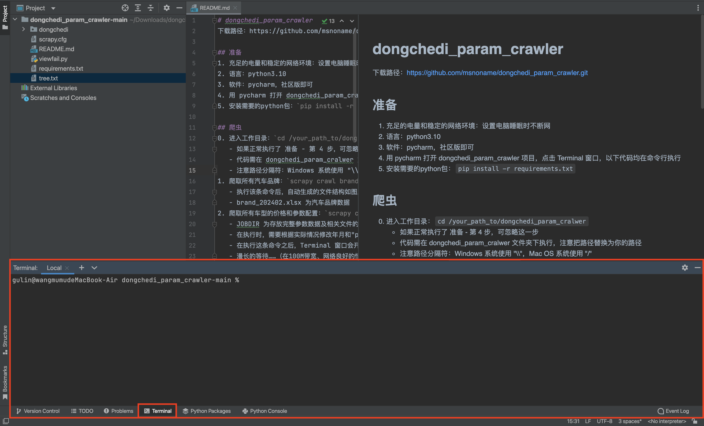
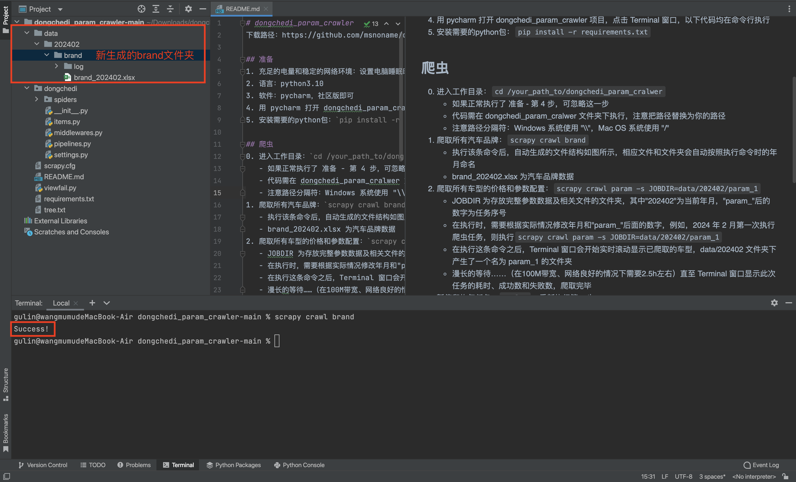
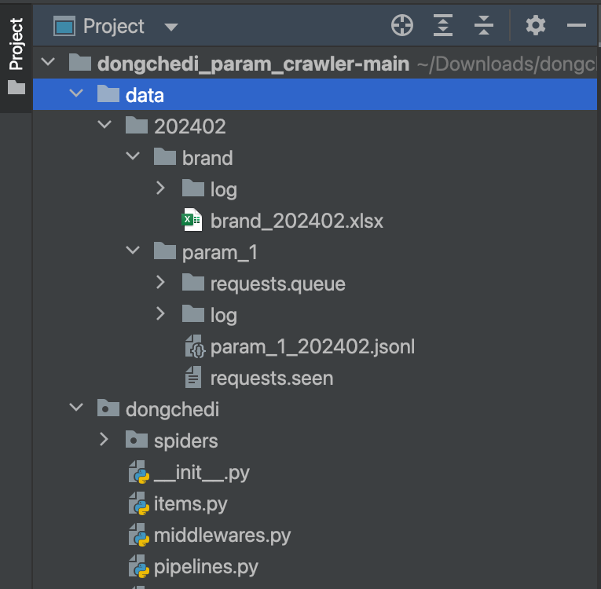
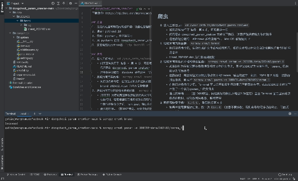
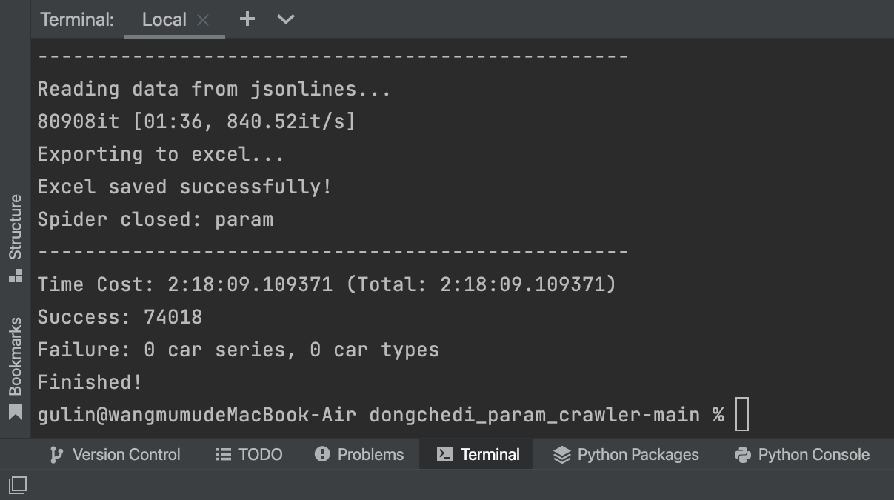

# dongchedi_param_crawler
下载路径：https://github.com/msnoname/dongchedi_param_crawler.git

## A. 准备
1. 充足的电量和稳定的网络环境：设置电脑睡眠时不断网
2. 语言：python3.10
3. 软件：pycharm，社区版即可
4. 用 pycharm 打开 dongchedi_param_crawler 项目，点击 Terminal 窗口，以下代码均在命令行执行<div align="center"></div>
5. 安装需要的python包：`pip install -r requirements.txt`

## B. 爬虫
0. 进入工作目录：`cd /your_path_to/dongchedi_param_cralwer`
   - 如果正常执行了 准备 - 第 4 步，可忽略这一步
   - 代码需在 dongchedi_param_cralwer 文件夹下执行，注意把路径替换为你的路径
   - 注意路径分隔符：Windows 系统使用 "\\\\"，Mac OS 系统使用 "/"
1. 爬取所有汽车品牌：`scrapy crawl brand`
   - 执行该条命令后，自动生成的文件结构如图所示，相应文件和文件夹会自动按照执行命令时的年月命名<div align="center"></div>
   - brand_202402.xlsx 为汽车品牌数据
2. 爬取所有车型的价格和参数配置：`scrapy crawl param -s JOBDIR=data/202402/param_1`
   - JOBDIR 为存放完整参数数据及相关文件的文件夹，其中"202402"为当前年月，"param_"后的数字为任务序号
   - 在执行时，需要根据实际情况修改年月和"param_"后面的数字，例如，2024 年 2 月第一次执行爬虫任务，则执行`scrapy crawl param -s JOBDIR=data/202402/param_1`
   - 在执行这条命令之后，Terminal 窗口会开始实时滚动显示已爬取的车型，data/202402 文件夹下产生了一个名为 param_1 的文件夹<div align="center"></div><div align="center"></div>
   - 漫长的等待……（在100M带宽、网络良好的情况下需要2.5h左右）直至 Terminal 窗口显示此次任务的耗时、成功数和失败数，爬取完毕<div align="center"></div>
3. 暂停和恢复任务：`Ctrl+C`，重新执行第 4 步
   - 如果中途需要暂停任务，按一次`Ctrl+C`（注意不要多按，否则会导致程序强行终止，可能丢失数据）
   - 等待一段时间，当 Terminal 窗口显示出 Finished! 时，可以重新执行第 4 步恢复爬虫，不需调整任务序号
   - 若多按了`Ctrl+C`强行终止程序，建议重启一个新的任务从头爬取：增加"param_"后的序号`scrapy crawl param -s JOBDIR=data/202402/param_2`，新的任务数据会储存在新的文件夹"param_2"中
   - 如无特殊情况最好不要中途暂停任务
4. 查看失败任务：`python viewfail.py param_1`，序号根据实际情况修改
   - car_series：爬取失败的车系，通常是因为有些车还没上市，未挂出车型信息
   - car_type：爬取失败的车型
   - 如果车系/车型网页正常，但爬取失败，可能是当时发生了网络错误，此时可以手动补全相应信息，如果错误较多，可以执行第 4 步重新爬取
5. 最终得到的完整文件为 param_x 文件夹中的 param_x_yyyymm.xlsx
   - 建议修改名称为 dongchedi_yyyymm.xlsx，做好备份

## C. 太长不看版
```shell
scrapy crawl brand
scrapy crawl param -s JOBDIR=data/202402/param_1  # 注意修改年月和任务序号
ctrl + C  # 暂停程序
```